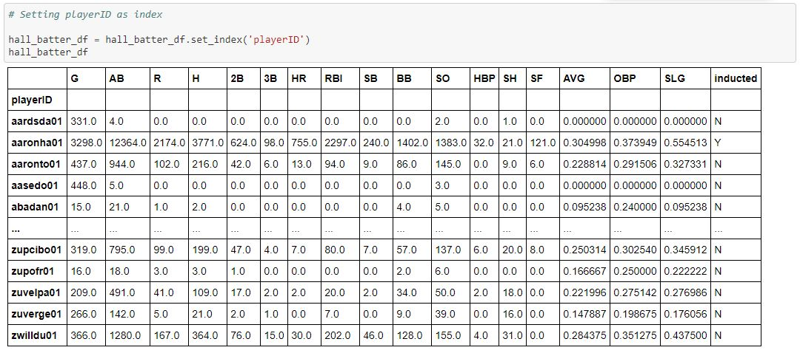

# Machine Learning and the Hall of Fame
Cale Green, Camille Goodwin, Claire Davis, Matt Martin, Silas Cobb, Trey Wehrmeyer 

---

# Overview 
- Proposal
- Resources
- Technologies Used
- Process (ETL, Database, Machine Learning, Visualizations, Deployment & Heroku)
- Web App - Live Demo
- Pitch & Selling Points
- Future Advancements

---
# Proposal 
## Using machine learning to predict future members to the Baseball Hall of Fame

- Predict future inductees
- Examine the statistically-worthy players who have not yet been inducted
- Recognize historically underrated players

---
# Resources

*[Sean Lahman's Baseball Databse](http://www.seanlahman.com/baseball-archive/statistics/)*

*[Baseball Reference](https://www.baseball-reference.com/)*

*[Baseball Hall](https://baseballhall.org/)*

*[Fangraphs](https://www.fangraphs.com/)*

Tables Used:
- Pitching.csv
- Batting.csv
- HallOfFame.csv

[For additional information and resources: Click Here!](https://github.com/greensleeves8/Final_Project_Baseball)

---
# Technologies Used

- Python and Pandas for data exploration and ETL
- PostgreSQL for a database
- Extreme Gradient Boosting machine learning model
- Matplotlib for visualization of findings
- Heroku, Flask, HTML, and JavaScript for dashboard creation and deployment
  
---
# ETL
### Batting ETL:
Created Career_Batting_df by:
- Merging Batting and Hall of Fame CSV's
- Dropping columns with too many null values
- Adding some necessary calculated statistics 
### Pitching ETL:
Created Career_Pitching_df by:
- Merging the pitching and Hall of Fame CSV's
- Dropping players who did not meet the minimum time to be eligible for the HOF
- Additional necessary calculated columns were added

---
### Final Hall Batter Dataframe in Jupyter Notebook

---
# Database
- Create connection to database from ETL documents
- Import 4 tables to PostgreSQL
- Pull tables from Postgres to machine learning documents with cursor object

---
### Entity Relationship Diagram
 

---
# Live Demo

https://hall-of-fame-baseball.herokuapp.com/

---
# Machine Learning Model
- Targeted high precision scores 
  - If predicted in HOF, how likely is it true
- High recall
  - Finding eligible players from so many ineligible
- Random Forest Classifier: 99.2% Accuracy, 0.63 precision, 0.44 recall
- Logistic Regression: 99.4% Accuracy, 0.59 precision, 0.56 recall 
- XGBoost with SMOTE: 98.9% Accuracy, 0.46 precision, 0.77 recall

---
<!-- decision tree images -->

---
# Deployment and Heroku
- Used HTML, CSS, Boostrap, JS, Python, and Flask to build dynamic webpage
- Ability to scrape HOF website top article and pictures
- Set up file system according to Heroku's speicifcations to deploy our project
  - h_app, html files, Procfile, requirements, wsgi

---
# Pitch & Selling Points
- Tool for fans and professionals to evaluate players' Hall of Fame case based solely on their on-field production, with a high degree of accuracy
- Sell to baseball teams for drafting players or Hall of Fame electors 
- Takes bias out of the process
- Easy to update and run year after year

---
# Future Advancements
- Expand to other sports, awards, all star teams
- Prediction table to display odds of players being inducted

---
# Thank you for your attention.
# Any questions or concerns? 