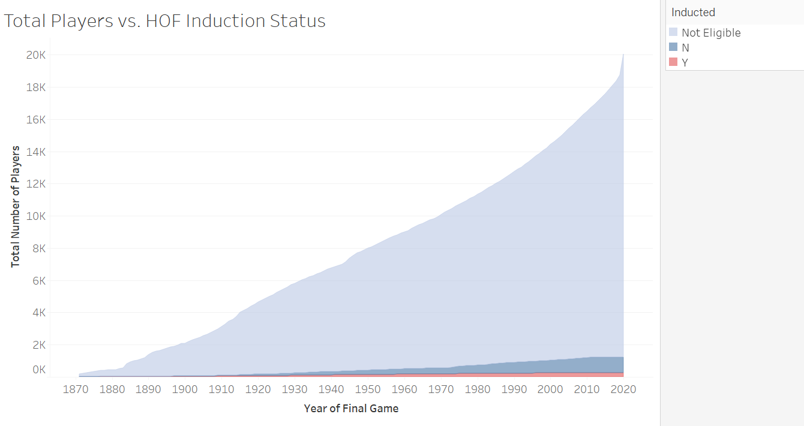
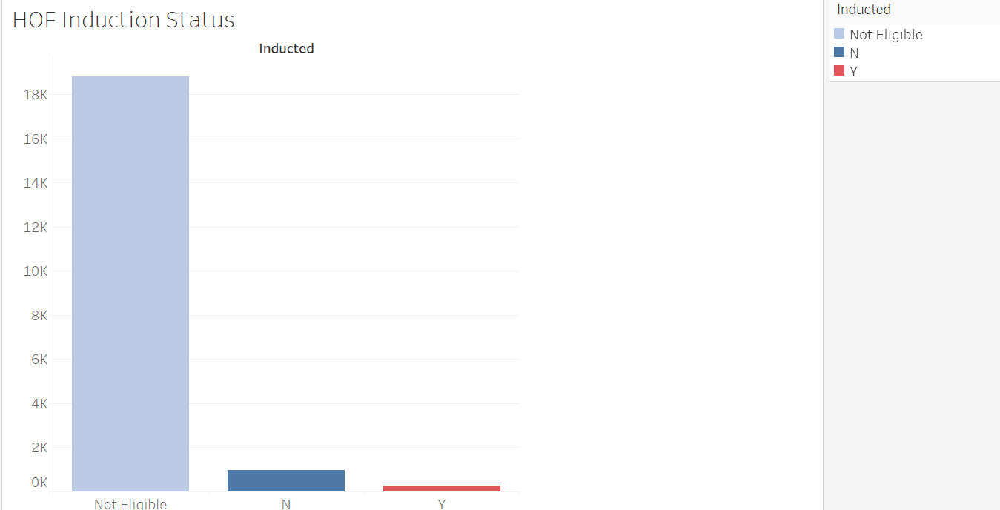

 
  

 
 Machine Learning and the Baseball Hall of Fame 

## Introduction

The National Baseball Hall of Fame inducted its first eligible members in 1936.  Soon after, in 1939, the Baseball Hall of Fame Museum was opened in Cooperstown, NY.  Since its establishment, each year members of the Baseball Writer's Association of America (BBWAA) vote on eligible candidates to be inducted into the Baseball Hall of Fame.  Major League Baseball players are considered eligible candidates if the baseball player:

* Was an active MLB player at least 15 years prior to the year of the election.
* Has been retired for at least 5 years prior to the election.
* Has played in a minimum of 10 seasons.
* Cannot be on the Baseball Hall of Fame ineligible list.  

Once a candidate is deemed eligible, multiple criteria are taken into consideration when voting occurs, such as the player's record/statistics, ability, integrity, and contribution to a team.  Members of the BBWAA cast no more than 10 votes on each years ballot for the candidates of their choosing.  Any candidate that receives votes on at least 75% of the ballots will be inducted to the Hall of Fame.

:baseball: **Team members:** Cale Green, Camille Goodwin, Claire Davis, Matt Martin, Silas Cobb, Trey Wehrmeyer :baseball:

## Can Machine Learning be used to identify MLB Hall of Famers?

Taking into consideration the process and requirements of being inducted into the Baseball Hall of Fame, a machine learning model will be developed and used to identify past Hall of Famers and predict future inductees.  In addition, this model will help recognize historically underrated players and examine the statistically-worthy players who have not yet been inducted to the Hall of Fame.  Ideally, the machine learning model will be able to be applied to future datasets and predict Hall of Fame inductees with an above average level of accuracy.

## Our Product

Membership in the National Baseball Hall of Fame is considered one of the highest honors in all of sports. Of the roughly 20,000 players in history to appear in a Major League game, 
only 263 have been elected to the Hall as players (1.3%). In fact, gaining entrance to the hall seems to become more difficult over time. After the 1970 season, 1.9% of players in history
had gained entrance to the hall, meaning that under 1% of players since that point have been elected. The task of electing players to the hall has become more and more difficult over time
as baseball writers and veterans' committee members have to weigh the effects of changes in the style of play, fallout from the Steroids era, and intangible qualities such as a player's sportsmanship, 
character, and integrity. What our Hall of Fame Predictor does is create a tool for fans to evaluate players' Hall of Fame case based solely on their on-field production, with a high degree
of accuracy. Our predictions are based on a database built of nearly every player in baseball history, allowing for players to be compared across eras and varying styles of play. Who's most likely 
to be elected next year? Who had the better Hall of Fame resume, Babe Ruth or Hank Aaron? Which non-members have the most compelling statistical case for inclusion? All of these can be 
answered with our Hall of Fame Predictor.

# Table of Contents
- [Table of Contents](#table-of-contents)
	- [Communication](#communication)
	- [Technologies](#technologies)
	- [Resources](#resources)
	- [Data Exploration](#data-exploration)
	- [Extract, Transform, Load](#extract-transform-load)
	- [Database](#database)
	- [Machine Learning Model](#machine-learning-model)
	- [Visualizations](#visualizations)
	- [Deployment](#deployment)
		- [Heroku](#heroku)
	- [Credits](#credits)

## Communication

The below methods of communication have been agreed upon by all team members and will be utilized daily and weekly to successfully complete the project:

* GitHub will house the project's repository where team members will be able to push completed work to feature branches, which will then be merged to the main accordingly.
* Zoom virtual meetings as needed outside of devoted Tuesday and Thursday evenings to further supplement collaboration and progress.
* Slack messaging to post and share a running thread of resources, ideas, and updates visible to all team members.
*  A Trello board will be utilized to better manage incomplete, in progress, and completed tasks for the project by team members.  

## Technologies

The following various technologies will be used throughout the completion of this project:

* Python and Pandas for data exploration and ETL
* PostgreSQL for a database
* Random Forest Classifier machine learning model
* Matplotlib for visualization of findings
* Heroku, Flask, HTML, and JavaScript for dashboard creation and deployment

## Resources

[Baseball-Reference.com: MLB Stats, Scores, History, and Records](https://www.baseball-reference.com/ "Baseball-Reference.com")

[Sean Lahman's Baseball Database](http://www.seanlahman.com/baseball-archive/statistics/ "Sean Lahman's Baseball Database")

[Baseball Hall](https://baseballhall.org/)

[Fangraphs](https://www.fangraphs.com/)

## Data Exploration

## Extract, Transform, Load

Batting ETL:

- When creating our Career_Batting_df we started by reading in the Batting.csv and HallOfFame.csv from Sean Lahman's Baseball Database. 
The HallOfFame dataframe was then filtered to only include members inducted as players, omitting executives/pioneers, managers, and umpires.
In order to clean up the data, we took out columns that had high null values (CS, IBB, GIDP). Individual player seasons were then grouped together
to create a dataframe of career batting statistics, and then the 'yearID' and 'stint' columns were dropped from the dataframe, and new columns were created to add several key statistics (Batting Average(AVG), On Base Percentage(OBP), and Slugging Percentage(SLG)). Further remaining null values
in the dataframe were then replaced with zeroes. At this point the career batting dataframe and Hall of Fame dataframe were merged together
to create a new dataframe of career statistics with Hall of Fame status included. This dataframe was then filtered to omit players who had never had an official MLB at-bat. Finally, 
an additional level of filtering was added to omit pitchers inducted to the Hall of Fame from the batting database, as their inclusion would otherwise
skew the results of the model (players with under 3000 career at-bats who had been inducted to the Hall of Fame were omitted, which removed 71 entries from the dataframe).
At this point, our training dataframe was complete, containing 17,522 of the roughly 20,000 players to have appeared in Major League Baseball history, and all of
the position players to be elected to the Hall of Fame. 
- One of the issues we ran into on the Career_Batting_df was making our filter too narrow. We started by creating a filter of 2,000 at-bats(Ab) or higher and this ended up dropping our eligible player much lower than we wanted. 
We ended up filtering out any player who did not have an AB in the MLB since that helped eliminate pitchers and players with limited or no batting stats. One final
issue that arose in the process of creating our training dataframe was how to handle pitchers in the batting dataframe. National League pitchers and any pitcher to play before
the advent of the Designated Hitter rule accumulated fairly large amounts of career at-bats, with near universally poor performance. Because any of the pitchers would show up
as a Hall of Fame inductee in our dataframe, we decided to omit them from it, due to the likelihood that it would skew the machine learning model's performance. 

Pitching ETL:

- Within the Career_Pitching_df, our first focus was similar to the process with the batter ETL, this time reading in the Pitching.csv and HallOfFame.csv from Sean Lahman's Baseball Database. 
The Hall of Fame dataframe was then filtered to only include individuals voted on as players. Statistics with high rates of null values were then dropped from the pitching statistic dataframe
(SH, SF, IBB, GIDP, plus the 'yearID' and 'stint' columns). Career statistics were then accumulated, and new statistical columns were added for Win Percentage, Strikeout/Walk Ratio, Walks and
Hits per Inning Pitched, and Earned Run Average. Existing null values were then replaced with zeroes, and then the career pitching and Hall of Fame status dataframes were merged to create a 
dataframe of career statistics and Hall of Fame status. Finally the dataframe was filtered to omit players who had never recorded a strike out or had an infinite Strikeout/Walk ratio due to
small sample size, and columns were dropped due to collinearity or redundancy. 
- We did run into an issue early on when creating the Career_Pitching_df.  We found that the CSV file did not have the correct pitcher ERA because the IPOuts column was not in its final form.  We had to add an IP column by dividing the IPOuts by three.

## Database

Once ETL was finalized we worked on putting the four data frames created (career_batter_df, hall_batter_df, career_pitching_df, and hall_pitching_df) into a local host PostgreSQL database. We were able to create a connection by adding code into the Career_Batters and Career_Pitching IPYNB files. Steps taken to create this connection were to import create_engine from sqlalchemy, import the databse password from a config file, create a connection string and database engine, then to import each table. 

Once our tables were created in Postgres, the next step was to pull the tables from Postgres to run through the machine learning model. We added this connection in the Batter and Pitcher RFC Model notebooks so we could pull the tables needed to run through the model. This was done by establishing a connection to the database with a cursor object, writing SQL statements to seelct the entirety of our tables, and saving them to a variable we could use moving forward. 

## Machine Learning Model

An ideal machine learning model for determining Baseball Hall of Fame inductees is one that has a high recall/sensitivity score, exemplifying the model's capability of finding worthy candidates for the Hall of Fame within a given dataset (finding a yes in a sea of no's).  Focusing on the model's ability to predict whether a player has been or will be inducted to the Hall of Fame is more important than the model's ability to predict if a player has not or will not be inducted into the Hall of Fame.  After testing various machine learning models and adjusting the parameters for the models, the model that performed the best was used with the pitching dataset.   

Prior to developing and running the machine learning models, the same preprocessing steps were applied to the batting dataset for each model:

* The **inducted** column is converted from values of Y and N, to 1 and 0 respectively- enabling the models to classify baseball players' inducted status numerically.
* The target variable, **y**, is assigned to the "inducted column".
* The features, **X**, is assigned to the remaining columns of baseball player stats.
* The assigned variables are then split into training and testing sets, utizlizing **train_test_split** from scikit-learn.
* Finally, **X** is then scaled so that all statistics within the datset fall within the same range of values, helping the model interpret the data more accurately.  

Once preprocessing the data was complete the XGBoost classifier, Random Forest Classifier and Logisitic Regression machine learning models were used to make predict the inducted status of baseball batters for the Baseball Hall of Fame.  The first model that was tested, the Random Forest Classifier model, performed with 99.3% accuracy, 0.63 precision and 0.44 recall for classifying an inducted status for the Hall of Fame.  Adjustments were made to the sampling sizes in an effort to bring balance to the overwhelming amount of baseball players not inducted into the Hall of Fame.  Even with these adjustments, the recall performance for this model was not ideal. A Logisitic Regression model was then developed and implemented, with the hope that setting the threshold would provide more reliable results (circling back to the requirement of at least 75% of the total votes cast in order to be inducted).  Adjusting the threshold, unfortunately failed in adding value to the results.  Finally, using a XGBoost classification model performed with the highest recall of all the models.  The SMOTE and SMOTEEN sampling methods were implemented to address the dataset's highly imbalanced status, in an effort to bring more balance to the model's interpretation of the dataset.  Combining the XGBoost classification model with SMOTE sampling, proved to be the most reliable model of all that were tested.  Below are the performance results of all tested models with the batting dataset:

| Model and Sampling Method | Accuracy | Yes/No |Precision | Recall | F-1 Score | | | Confusion Matrix | |
| --------------- | -------- | ------ |--------- | ------ | --------- | - | - | - | - |
| *XGBoost Classifier with SMOTE* | 98.9% | *No* | 1.00 | 0.99 | 0.99 | | | *Predicted No* | *Predicted Yes* |
| | | *Yes* | 0.46 | 0.77 | 0.58 | | *Actual No* | 4307 | 35 |
| | | | | | | | *Actual Yes* | 9 | 30 |
| *Random Forest Classifier (RFC)* | 99.2% | *No* | 0.99 | 1.00 | 1.00 | | | *Predicted No* | *Predicted Yes* |
| | | *Yes* | 0.63 | 0.44 | 0.52 | | *Actual No* | 4332 | 10 |
| | | | | | | | *Actual Yes* | 22 | 17 |
| *RFC with SMOTE* | 98.5% | *No* | 1.00 | 0.99 | 0.99 | | | *Predicted No* | *Predicted Yes* |
| | | *Yes* | 0.31 | 0.76 | 0.44 | | *Actual No* | 4285 | 58 |
| | | | | | | | *Actual Yes* | 8 | 26 |
| *Logistic Regression* | 99.4% | *No* | 1.00 | 1.00 | 1.00 | | | *Predicted No* | *Predicted Yes* |
| | | *Yes* | 0.59 | 0.56 | 0.58 | | *Actual No* | 4330 | 13 |
| | | | | | | | *Actual Yes* | 15 | 19 |
| *Logistic Regression with 75% Threshold* | 99.4% | *No* | 0.99 | 1.00 | 1.00 | | | *Predicted No* | *Predicted Yes* |
| | | *Yes* | 0.71 | 0.35 | 0.47 | | *Actual No* | 4338 | 5 |
| | | | | | | | *Actual Yes* | 22 | 12 |

Although, the Random Forest Classifier model combined with SMOTE sampling performed with a the second highest recall, the difference between the false positives and true positives for the RFC model with SMOTE was much greater than those of the XGBoost model with SMOTE.  Due to this reasoning and the model's overall performance, the XGBoost classification model combined with SMOTE performed the best when presented with the Hall of Fame dataset.

Once the machine learning model and sampling method were decided upon through training and testing of the batter dataset, the same process was appied to the pitcher dataset.  Below are the results:

| Model and Sampling Method | Accuracy | Yes/No |Precision | Recall | F-1 Score | | | Confusion Matrix | |
| --------------- | -------- | ------ |--------- | ------ | --------- | - | - | - | - |
| *XGBoost Classifier with SMOTE* | 99.3% | *No* | 1.00 | 0.99 | 1.00 | | | *Predicted No* | *Predicted Yes* |
| | | *Yes* | 0.57 | 0.76 | 0.65 | | *Actual No* | 2251 | 12 |
| | | | | | | | *Actual Yes* | 5 | 16 |

## Visualizations
Visualizations were created in Tableau to demonstrate how rare it is to be inducted to the Baseball Hall of Fame, and how it has become even more difficult to be competitive over time. A snapshot of these visualizations will be shown on the web app. 

This chart illustrates the increasing rarity of which players get inducted into the HOF. As the total number of players has steadily increased over the past 150 years - the number of inducted players has risen at a much slower scale.

This bar chart visualization shows total number of players inducted to the HOF in baseball history, total number of players nominated but not inducted to the HOF, and lastly (also by far most commonly) all other players. This visualization helps to clarify and separate the nominees who did and did not get in to the HOF.

## Deployment
For User-Facing purposes - technologies implemented were a combination of

- HTML 
- CSS 
- Bootstrap
- JS 
- Python/Flask 

* HTML was used to structure and design our webpages 
	* 7 html files were created to host 6 different user experiences: 
		- Home Page
		- Project Background
		- Index of batting-categorized players pertaining to the project's player datasets
		- Index of pitching-categorized players pertaining to the project's player datasets
		- Scraping page which allows user-exploration of the Hall of Fame website
		- Machine Learning prediction page which showcases the model's results to user
* Bootstrap 4/CSS/JS allowed easy setup of NavBar functionality, a self-rotating image carousel, and many other design and formatting options.
* Python was used to implement a web-scraping script that allows us to pull current facets of the Baseball Hall of Fame's website such as their latest news article, and most recent historical image from their gallery page.
* Flask was used to to set up multiple routes for different web application functionalities.

### Heroku 
Heroku is a cloud-based service that has the functionality to connect to Github, which creates automatic deployment of our project.  

[Hall of Fame Baseball App](https://hall-of-fame-baseball.herokuapp.com/)

Continuous code can be committed to the repository and then deployed within the Heroku platform by initially setting up the following files:
* h_app: is the app folder created to contain the flask app and supporting templates
	* __init__.py: the file that creates the flask app and additional routes
	*static: this is a folder created to hold javascript and CSS
		* CSS: a folder that contains the CSS functionality 
			* style.css: contains the styling for the index page
			* analysis.css: contains the styling for the analysis page
			* background.css: contains the styling for the background page
			* batting.css: contains the styling for the batting page
			* pitching.css: contains the styling for the pitching page
		* Images: this file contains all the images that have been finalized for the app
			* carousel: these are the images used on the first page
			* final: these are the images used under the analysis page
		* JS: a folder that contains javascript files
			* script.js: this file creates the drop down functionality of baseball players
			* analysis.js: javascript functionality for popup feature on images
			* batter_data.js: batter data set up with variables for the batter.js file to read 
			* batter.js: javascript functionality to create filtered table under the batting page
			* pitcher_data.js: pitcher data set up with variables for the pitcher.js file to read 
			* pitcher.js: javascript functionality to create filtered table under the pitching page
	* templates: the folder created within the app folder to organize html files
		* base.html: creates the initial structure for our webpage
		* index.html: an extension from our base.html and contains the main content
		* background.html: the route created to contain all the background information required for understanding the purpose of the project 
		* scrape.html: the route created to have all the scraping elements from the official Hall of Fame website
* Procfile: this is file specifically used for Heroku to create the webserver and initialize the starting point
* requirements.txt: this text file shows all the packages being used 
* wsgi.py: this file imports our flask app
* hof_scraping.py: contains all dependencies and functionality in order to pull the images from the baseball hall of fame website into our heroku app

## Credits

This project would not have been possible without the use of [Sean Lahman's Baseball Database](http://www.seanlahman.com/baseball-archive/statistics/), which is used here under the conditions of the
[Creative Commons Attribution-ShareAlike 3.0 Unported License](https://creativecommons.org/licenses/by-sa/3.0/). Any changes made to the original database have been described in this README. Further use of 
this material is allowed under the same Creative Commons License.

“Homepage.” Baseball Hall of Fame, 23 Feb. 2021, baseballhall.org/. 
This resource was used to obtain the Baseball Hall of Fame logo that is presented at the top of this document. 
